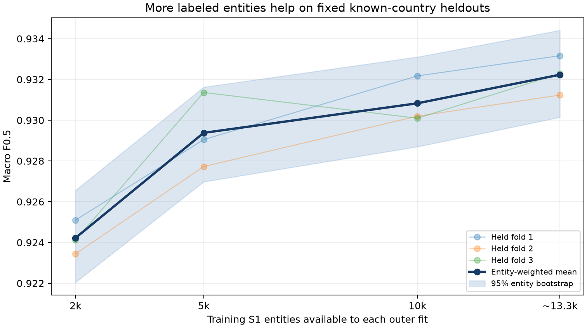

# Competitive status — 2026-09-25 IST

Leaderboard values below are reported by the user and have not been independently verified. They are context, not training labels or a threshold-tuning target.

| Field | Current value |
|---|---|
| Current leaderboard top | 0.976808 (user report, 25 Sep) |
| Third-place reference | 0.972446 (user report, 25 Sep) |
| Our public score | Pending; SUB-001 not submitted |
| Our rank | Pending |
| Delta to first | Pending our public score |
| Delta to third | Pending our public score |
| Best local nested OOF | 0.9318965293 macro F0.5, 20k natural entities |
| Fold 4 | CLOSED |
| Best validated experiment | P4-NUMERIC-B-001, 51-feature LightGBM |
| Best expected next gain | Full-data learning curve and precision-focused hard negatives; >=0.002 is an unverified experiment hypothesis, not a measured gain |
| Submissions used today | 0 recorded in SUBMISSIONS.csv; portal count not independently verified |
| Submissions left today | Up to 5 based on recorded history; confirm portal counter before upload |

SUB-001 is an explicitly authorized early calibration submission. Frozen model and threshold 0.83 are unchanged. The active detached Mac run is `aml-sub001-v005`, writing to `outputs/submissions/SUB-001/local-full-v005/inference`. Official validation and SHA256 hashes are pending. If the healthy run stalls, use approved SageMaker ml.r5.2xlarge Processing for only unfinished deterministic shards, with a hard runtime and cost ceiling. The separate full-training retrieval remains active on EC2.

The 25 September user snapshot also reports second 0.976407 and ranks 4–9 around 0.971, 0.968, 0.965, 0.963, 0.962 and 0.958. These values must not be compared directly with the different-distribution local OOF score. Our public score and rank remain unknown until the user uploads the validated files. Do not use portal submissions to probe thresholds.

| Learning-curve size | Numeric-v2 result |
|---:|---|
| 20k | 0.9318965293 nested OOF |
| 50k | Pending scalable candidate/features |
| 100k | Pending |
| 250k | Pending |
| 500k | Pending |
| 1M+ | Pending |

EXP-027 is a separate diagnostic on fixed outer folds 1–3, with the same held-out entities for every training size: 2k fit entities scored 0.924221; 5k 0.929379; 10k 0.930829; and the available ~13.3k per fold scored 0.932231. Scores are entity-count-weighted across the three held-out folds. This supports further training-data work on the known countries, but does not estimate the gain from 50k+ examples or predict France/public leaderboard performance. Its thresholds came from the prior 20k nested procedure and were not independently tuned for each size. Full results: `outputs/experiments/EXP-027-v002/metrics.json`.

India priority: use known missed-link categories (weak address, non-ASCII target name and transliteration) to test targeted retrieval rescue with marginal recall and candidate cost. France priority: analyze only unlabeled test covariates, candidate densities and frozen model score/predicted-singleton distributions; no external identity lookups or hidden-label inference. No new public-score-driven threshold sweep.
