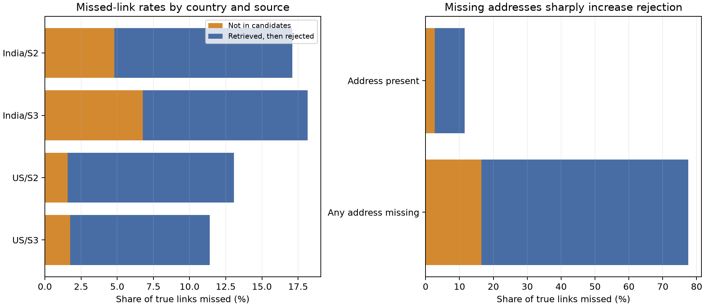

# Phase5 numeric-v2 error slices

Scope: the already-inspected 20,000 natural development entities in folds 1–3, using the frozen P4-B-002 name/address char3 candidate union and NUMERIC-V2 outer-fold predictions. Fold4 remains closed. Counts are links, not per-entity macro-score deltas, and observed associations are not proof of causes. Reproduce with `PYTHONPATH=code/business_entity_resolution .venv/bin/python scripts/analysis/phase5_numeric_error_slices.py`; aggregate output is `outputs/analysis/P5-NUMERIC-ERRORS-004/report.json`.

| Slice | True links | Retrieval misses | Retrieved but rejected | Predicted true links |
|---|---:|---:|---:|---:|
| All | 69,366 | 2,315 | 7,678 | 59,373 |
| India | 28,101 | 1,632 | 3,327 | 23,142 |
| US | 41,265 | 683 | 4,351 | 36,231 |
| S2 | 33,535 | 962 | 3,967 | 28,606 |
| S3 | 35,831 | 1,353 | 3,711 | 30,767 |
| Any address missing | 3,045 | 501 | 1,860 | 684 |
| Both addresses present | 66,321 | 1,814 | 5,818 | 58,689 |
| Non-ASCII target name | 9,409 | 1,023 | 990 | 7,396 |
| ASCII target name | 59,957 | 1,292 | 6,688 | 51,977 |

India/S3 accounts for 982 of the 2,315 retrieval misses. The observed link-level recall is 93.24% for that country/source slice versus 98.26% for US/S3. The non-ASCII target-name slice has 89.13% candidate recall versus 97.85% for ASCII target names. These slices overlap; totals must not be added across rows.

Address-missing links are especially difficult: only 684/3,045 (22.46%) are predicted. Of the 2,361 missed links, 501 were never candidates and 1,860 were retrieved but rejected. The current model's predicted-pair precision on this slice is 684/873 (78.35%), compared with 58,689/59,614 (98.45%) when both addresses are present. Lowering a blanket threshold for missing addresses would likely create costly false merges. This is a priority for controlled, nested experiments using stronger independent name or source evidence, not a rule to apply directly.

Next measured tests: (1) inspect India/S3 and non-ASCII misses by retrieval route and uncapped rank on a bounded development sample; (2) test a small transliteration-aware route only where it adds new labeled links at tolerable candidate cost; (3) fit and calibrate any address-missing treatment solely on inner entity folds, then measure per-entity macro F0.5 and false merges on outer folds. Preserve the frozen SUB-001 run while these are explored for later submissions.

EXP-029 completed the threshold-only version of test (3) using the 20k NUMERIC-V2 model, inner two-fold threshold selection for each outer fold, and no Fold4. All three inner selections chose 0.90 for address-missing pairs; outer-fold scores fell by 0.002324, 0.000318 and 0.001430. Pooled macro F0.5 fell from 0.931897 to 0.930533, paired delta -0.001363 with 95% entity-bootstrap interval [-0.002074, -0.000677]. Precision rose while recall fell. Reject this simple threshold split. The result does not exclude richer, independently corroborated missing-address evidence, but there is no basis to change the frozen submission.
